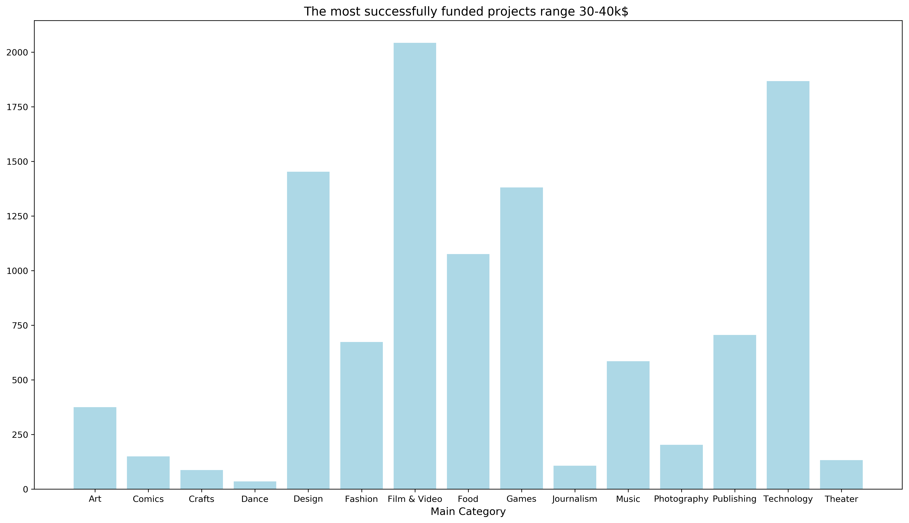
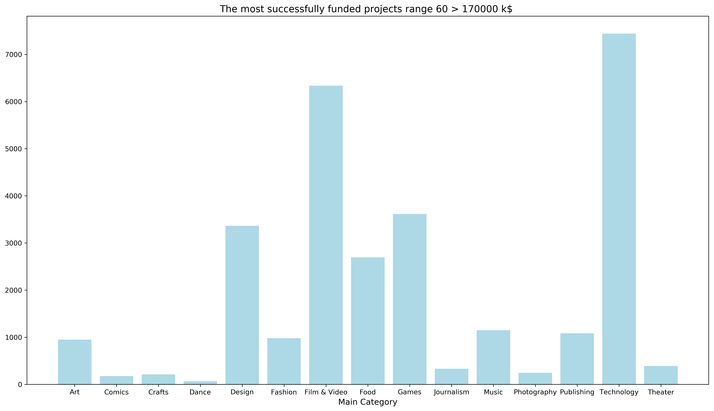

# 30 cm Python

## Emil Rasmussen, Lasse Vistrup Rasmussen, Menja Holm Wettergren & Xu Zhen Yang

### Dataset

[ks-projects](https://github.com/mathiasjepsen/PythonDatasetAssignment/raw/master/ks-projects-201801.csv)

### Dependencies & how to run

The following dependencies should be installed in your system, either via `conda install` or `pip install`

```python
from collections import Counter
import matplotlib.pyplot as plt
import pandas as pd
import statistics
import webget
import os
```

Clone from git repository, `cd Den_4_april` and run the project from command promt with the command line:

`python run.py`

Or by opening the run file in your chosen environment and running the file.

Our run.py file contains a webget that downloads the dataset upon running the file. 

### Answers

#### Question 1

1. What main-category of project has the highest success rate?

The highest success rate of project is: **Music : 24197**


#### Question 2

2. For the main-category of project with highest success rate (question above), what is the main-category with the highest number of project proposals?
The highest number of project proposals is: **Film & Video**


#### Question 3

3. What is the median pledged amount (usd_pledged_real) of successfully funded projects?
The median pledged amount (usd_pledged_real) of successfully funded projects is: **5107.25**

#### Question 4

4. What is the number of successfully funded projects with more than 5.000$ pledged (usd_pledged_real) per main-category?
The number of successfully funded projects with more than 5.000$ pledged is: **Film & Video : 12505**


#### Question 5

5. For the main-category with the most successfully funded projects (quantity, not rate of success), what is the goal-amount range (usd_goal_real), e.g. range 0-10k$ , 5-15k$, 100k$-110k$, that contains the most successfully funded projects (in quantity, not rate of success)?
```
Range 0 - 10k$ are: [('Music', 42692), ('Film & Video', 40203), ('Publishing', 30876), ('Art', 23370), ('Games', 20875), ('Fashion', 15273), ('Design', 15179), ('Food', 12829), ('Technology', 12407), ('Theater', 9066), ('Comics', 8925), ('Photography', 8443), ('Crafts', 7452), ('Journalism', 3382), ('Dance', 3272)]

Range 10k - 20k are: [('Film & Video', 8449), ('Games', 5504), ('Design', 5434), ('Music', 5339), ('Technology', 4798), ('Publishing', 4734), ('Food', 4373), ('Fashion', 3593), ('Art', 2215), ('Photography', 1263), ('Comics', 1072), ('Theater', 838), ('Crafts', 693), ('Journalism', 522), ('Dance', 274)]

Range 20k - 30k are: [('Film & Video', 4317), ('Technology', 3497), ('Design', 3097), ('Games', 2598), ('Food', 2489), ('Publishing', 1875), ('Fashion', 1721), ('Music', 1614), ('Art', 890), ('Photography', 478), ('Comics', 369), ('Theater', 330), ('Journalism', 274), ('Crafts', 237), ('Dance', 82)]

Range 30k - 40k are: [('Film & Video', 2043), ('Technology', 1868), ('Design', 1453), ('Games', 1381), ('Food', 1076), ('Publishing', 706), ('Fashion', 674), ('Music', 585), ('Art', 375), ('Photography', 203), ('Comics', 150), ('Theater', 133), ('Journalism', 107), ('Crafts', 87), ('Dance', 35)]

Range 40k - 50k are: [('Technology', 2559), ('Film & Video', 2235), ('Design', 1542), ('Games', 1257), ('Food', 1140), ('Publishing', 598), ('Fashion', 576), ('Music', 540), ('Art', 355), ('Theater', 154), ('Photography', 148), ('Journalism', 137), ('Crafts', 129), ('Comics', 126), ('Dance', 38)]

Range 60k and more are: [('Technology', 7440), ('Film & Video', 6338), ('Games', 3616), ('Design', 3365), ('Food', 2695), ('Music', 1148), ('Publishing', 1085), ('Fashion', 979), ('Art', 948), ('Theater', 392), ('Journalism', 333), ('Photography', 244), ('Crafts', 211), ('Comics', 177), ('Dance', 67)]
```





