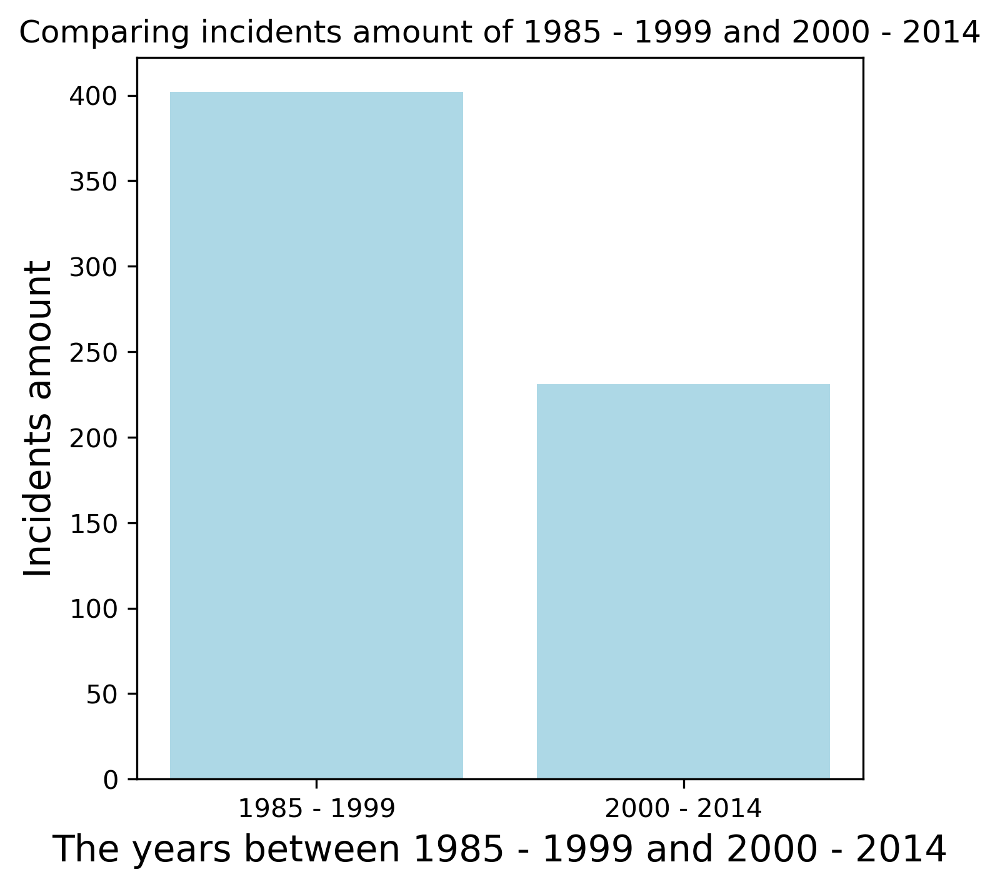

# 30 cm Python

## Emil Rasmussen, Lasse Vistrup Rasmussen, Menja Holm Wettergren & Xu Zhen Yang

### Dataset Charming P*

[Charming P](https://raw.githubusercontent.com/fivethirtyeight/data/master/airline-safety/airline-safety.csv)

### Dependencies & how to run

The following dependencies should be installed in your system, either via `conda install` or `pip install`

```python
import webget
import pandas as pd
import matplotlib.pyplot as plt
import os
```

Clone from git repository, `cd Assignment9` and run the project from command promt with the command line:

`python run.py`

Or by opening the run file in your chosen environment and running the file.

Our run.py file contains a webget that downloads the dataset upon running the file. 

### Answers

#### Question 1

1. How many incidents happened between 1985-1999?

Between 1985 - 1999 has been 402 incidents

#### Question 2

2. How many death-incidents happened between 1985-1999?

Between 1985 - 1999 has been 122 death-incidents

#### Question 3

3. How many incidents happened between 2000-2014?

Between 2000 - 2014 has been 231 incidents

#### Question 4

4. How many death-incidents happened between 2000-2014?
Between 2000 - 2014 has been 37 death-incidents

#### Question 5

5. Has the amount of incidents increased, comparing the later statistics to the earlier ones?

The incidents amount has been decreased since 1985 to 2014


