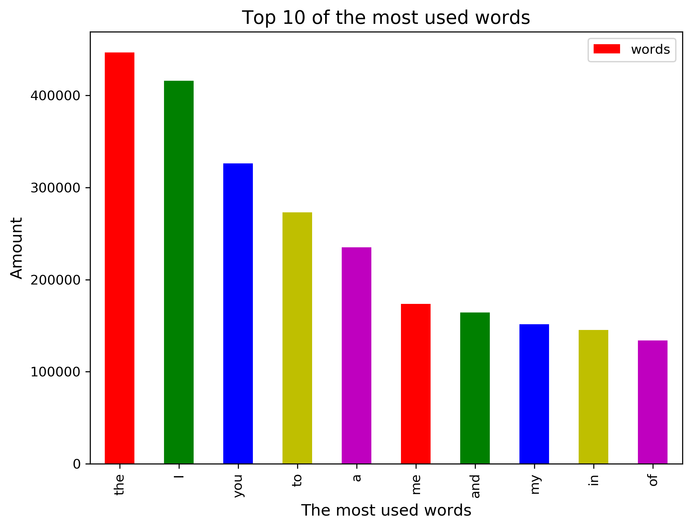
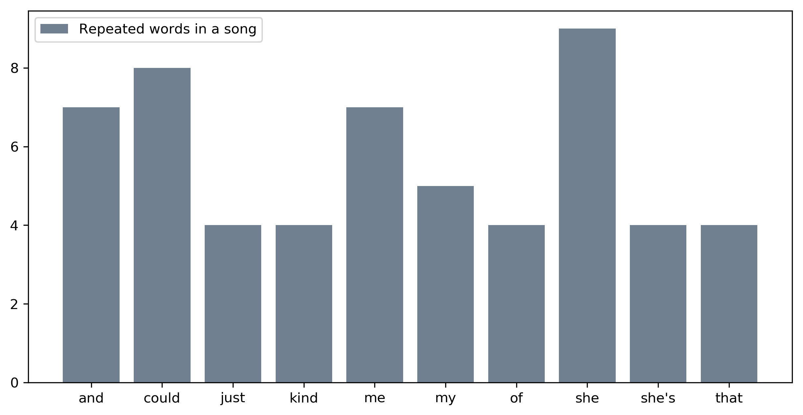

# 30 cm Python

## Emil Rasmussen, Lasse Vistrup Rasmussen, Menja Holm Wettergren & Xu Zhen Yang

### Dataset

[55000+ Song lyrics dataset](https://github.com/KasperOnFire/ImpossibleTechnology/blob/master/Datasets/songdata.csv)

### Dependencies & how to run

The following dependencies should be installed in your system, either via `conda install` or `pip install`

```python
import pandas
import matplotlib
import webget
from collections import Counter
import numpy
import os
```

Clone from git repository, `cd Den_4_april` and run the project from command promt with the command line:

`python handin_4_april.py`

Or by opening the run file in your chosen environment and running the file.

Our run.py file contains a webget that downloads the dataset upon running the file. 

Our answer to question 4 takes a while. Don't worry it has not crashed - give it time!

### Images

#### Question 1



#### Question 2




### Questions

Question 1: What is the most used words in the songs?

Question 2: How many times are each word repeated in a song? (Or perhaps - what song repeats the top 4 repeated words the most? - finds the most repetitive song)

Question 3: What song uses the word "X" the most time? (X meaning a specific word, choose your own!)

Question 4: What is the average number of words per song?

Question 5: Show the distribution of number of words in the songs. (Example: how many songs have 5-10 words, 10-20 words)

### Answers

1. 2016 is the year with the most releases, see image 1.

2. 2017 is the result we found. See image 2.

3. The "Gameshow" genre has the longest average runtime. See Image 3.

4. Drama has the most movies in the dataset. See Image 4.

5. Average runtime on adult films is 104.74 minutes.